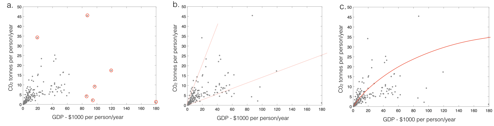
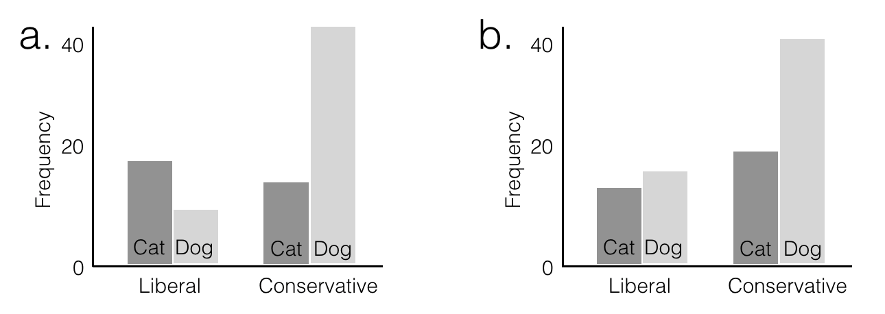

# Concepts Review

Here we review some conceptual points from the lecture.

Please try to answer each question yourself before clicking to reveal
the answer

You can discuss these points with your tutor at the computer-based
tutorial session (these sessions are for discussing concepts as well
as for developing Python skills)


<ol>
<li>A researcher measures weight (in stone) and height (in inches) for men. She calculates the correlation and covariance. She then decides to convert her data to metric units, kilograms and centimetres. One kilogram is 0.157 stone and one centimetre is 0.39 inches. What will happen to the correlation and covariance?

```{admonition} Click to reveal answer
:class: dropdown
correlation won’t change is it is normalized by s.d. in x and y and
therefore unaffected by units

covariance will increase as the spread in weight and height are both greater for metric units (ie range of weights in kg is greater than range of weights in stone; range of heights in cm is greater than range of heights in inches)

```


<li>What are the assumptions of Pearson's r?

```{admonition} Click to reveal answer
:class: dropdown
<ul>
<li> no outliers
<li> straight line relationship
<li> homoscedasticity 
</ul>

```


<li>Which features of each illustration above violate the assumptions
of Pearson's r?

```{admonition} Click to reveal answer
:class: dropdown
<ol type='a'>
<li> outliers
<li> heteroscedasticity
<li> straight line relationship
</ol>

```


<li>What is heteroscedasticity?

```{admonition} Click to reveal answer
:class: dropdown
The ice cream cone effect!

Heteroscedasticity is when the variance in y differs for different
values of x (or vice versa).

```


<li> Explain why heteroscedasticity is common in real datasets

```{admonition} Click to reveal answer
:class: dropdown

Often the variability in data is proportional to their mean
value.
<brb>
For example consider a dataset of weight (y) against age (x) from
birth to adulthood.
<br>
The difference between a light and heavy two year
old is only a few kg (as a two year old weighs less than 20kg), but
the difference between a light and heavy adult is much greater as the
average weight of an adult is greater.
```


<li> The two plots above show type of pet owned by two (fictional) samples
of men. For each man the researcher recorded whether he descriebs
himseld as politically liberal or conservative, and whether he prefers
cats or dogs

Explain what is meant by an interaction between categorical variables and why each of the plots
above illustrate such an interaction
```{admonition} Click to reveal answer
:class: dropdown

An interaction is when the proportion of cases of one variable (cat v
dog) differs depnding on the value of another variable (liberal v
conservative).

In example a, we have a crossover interaction, whereby more liberals
are cat owners (than dog owners), but the reverse is true for
conservatives.

In example b, we also have an interaction - in this case dogs are more
popular than cats in both political groups, but the proportion
preferring dogs is much greater in the conservative group, whilst
cats and dogs are more equally balanced in the liberal group.
```


